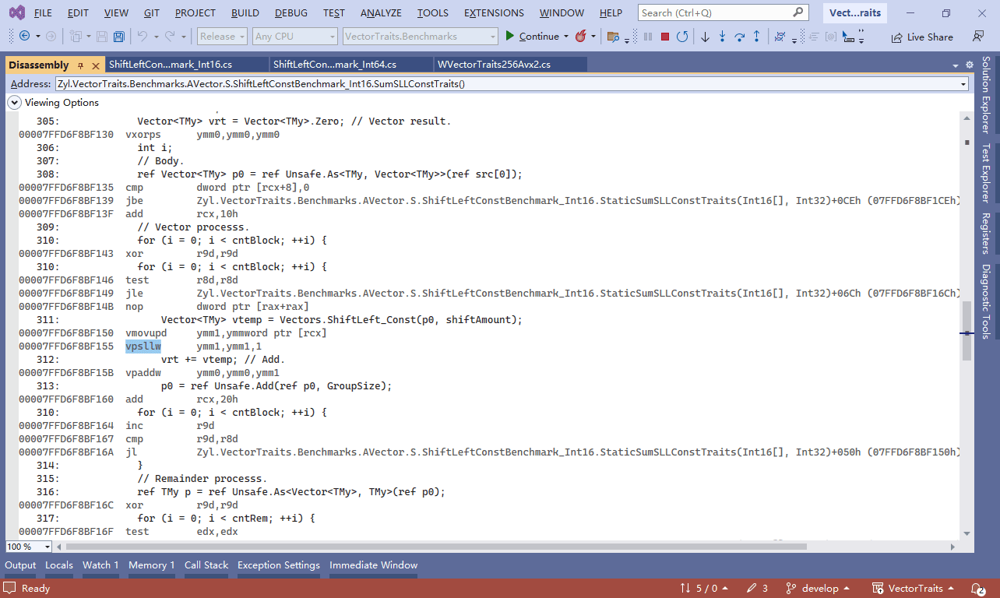

# VectorTraits
[English](README.md) | Chinese(中文)

VectorTraits: SIMD Vector type traits methods (SIMD向量类型的特征方法).

本库为向量类型提供了许多重要的算术方法(如 Shift, Shuffle, NarrowSaturate)及常数, 使您能更方便的编写跨平台的SIMD运算代码。它充分利用了 X86、Arm架构的内在函数实现硬件加速，且能够享受内联编译优化。

常用类型：
- `Vectors`: 为向量类型, 提供了常用工具函数, e.g. Create(T/T[]/Span/ReadOnlySpan), CreatePadding, CreateRotate, CreateByFunc, CreateByDouble ... 它还为向量提供了特征方法, e.g. ShiftLeft、ShiftRightArithmetic、ShiftRightLogical、Shuffle ...
- `Vectors<T>`: 为向量类型, 提供了各种元素类型的常数. e.g. Serial, SerialDesc, XyzwWMask, MantissaMask, MaxValue, MinValue, NormOne, FixedOne, E, Pi, Tau, VMaxByte, VReciprocalMaxSByte ...
- `Vector64s/Vector128s/Vector256s`: 为固定位宽的向量（Vector64/Vector128/Vector256），提供了常用工具函数与特征方法.
- `Vector64s<T>/Vector128s<T>/Vector256s<T>`: 为固定位宽的向量，提供了各种元素类型的常数.
- `Scalars`: 为标量类型, 提供了各种工具函数. e.g. GetByDouble, GetFixedByDouble, GetByBits, GetBitsMask ...
- `Scalars<T>`: 为标量类型, 提供了许多常数. e.g. ExponentBits, MantissaBits, MantissaMask, MaxValue, MinValue, NormOne, FixedOne, E, Pi, Tau, VMaxByte, VReciprocalMaxSByte ...
- `VectorTextUtil`: 提供了一些向量的文本性工具函数. e.g. GetHex, Format, WriteLine ...

特征方法:
- 支持 `.NET Standard 2.1` 新增的向量方法: ConvertToDouble, ConvertToInt32, ConvertToInt64, ConvertToSingle, ConvertToUInt32, ConvertToUInt64, Narrow, Widen .
- 支持 `.NET 5.0` 新增的向量方法: Ceiling, Floor .
- 支持 `.NET 6.0` 新增的向量方法: Sum .
- 支持 `.NET 7.0` 新增的向量方法: ExtractMostSignificantBits, Shuffle, ShiftLeft, ShiftRightArithmetic, ShiftRightLogical .
- 提供缩窄饱和的向量方法: YNarrowSaturate, YNarrowSaturateUnsigned .
- 提供换位的向量方法: YShuffleEach128, YShuffleInsert, YShuffleInsertEach128, YShuffleG4, YShuffleG4X2 . Also provides ShuffleControlG4 classes.
- ...
- 完整列表: [TraitsMethodList](TraitsMethodList.md)

支持的指令集:
- x86
  - 256位向量: Avx, Avx2 .
- Arm
  - 128位向量: AdvSimd .

## 用途
总所周知，使用SIMD指令集，能够加速 多媒体处理（图形、图像、音频、视频...）、人工智能、科学计算 等。
然而，传统的SIMD编程存在以下痛点：
- 难以跨平台。因为不同的CPU体系，提供了不同的SIMD指令集，例如 X86与Arm平台的SIMD指令集存在很多差异。如果程序欲移植到另一平台下，则需要查找该平台的SIMD指令集手册，重新开发一遍。
- 位宽难以升级。即使是同一个平台，随着发展，会逐渐增加位数更宽的指令集。例如X86平台，除了已淘汰的64位MMX系列指令外，提供了了 128位SSE指令集、256位的AVX指令集，且部分高端处理器开始支持 512位的AVX-512指令集。以前用128位SSE系列指令编写的算法，若想移植到256位的AVX指令集，需要重新开发一遍，才能充分利用更宽的SIMD指令集。
- 代码可读性差，开发门槛高。很多现代C语言编译器为SIMD指令，映射了`内在函数`（Intrinsic Functions），比编写汇编代码要容易了不少，且可读性提升了不少。但是由于函数名使用了一些晦涩的缩写，且C语言不支持函数名重载，以及C语言本身的复杂性，导致代码可读性与开发难度，仍有较高的门槛。

2016年的 `.NET Core 1.0` 新增了 `Vector<T>` 等向量类型，在很大程度上解决了以上痛点。
- 容易跨平台。`.NET`平台的程序，是通过JIT（Just-In-Time Compiler，即时编译器）运行的。只编写一套基于向量方法的算法，且仅需编译为一套程序。随后该程序在不同平台上运行时，向量方法会被JIT编译为平台特有的SIMD指令集，从而充分的享用硬件加速。
- 位宽能自动升级。对于`Vector<T>`类型，它的长度不是固定的，而是与该处理器的最长向量寄存器相同。具体来说，若CPU支持AVX指令集（严格来说是AVX2及以上），`Vector<T>`类型便是256位；若CPU仅支持SSE指令集（严格来说是SSE2及以上），`Vector<T>`类型便是128位。简单来说，在编写程序时仅使用`Vector<T>`类型就行，程序运行时，JIT会自动使用最宽的SIMD指令集。
- 代码可读性较高，降低了开发门槛。`.NET`平台下，向量类型的方法名都是用完整英文单词所组成，并充分利用了函数名重载等 C# 语法特点，使这些方法名既简洁、又清晰。使得代码可读性有了很大的提高。

向量类型`Vector<T>` 虽然设计的好，但它缺少许多重要的向量函数，如 Ceiling、Sum、Shift、Shuffle 等。导致很多算法，难以用向量类型来实现。
当 `.NET` 平台版本升级时, 有时会增加若干个向量方法。例如2022年发布的 `.NET 7.0`，增加了ShiftRightArithmetic、Shuffle 等函数。但目前的向量方法还是较少, 例如缺少饱和处理等.
为了解决缺少向量方法的问题，`.NET Core 3.0`开始支持了内在函数。这能让开发者直接使用SIMD指令集，但这又面临了难以跨平台与位宽难以升级等问题。随着 `.NET` 平台的不断升级，会增加了更多的内在函数。例如 `.NET 5.0` 增加了 Arm平台的内在函数。
对于开发类库, 不能仅支持 `.NET 7.0`，而是需要支持多个 `.NET` 版本。于是你会面临繁琐的版本检查与条件处理. 而且 `.NET Standard` 类库的最高版本(2.1)，仍是是不支持Ceiling等向量方法的，导致版本检查更加繁琐. 

本库致力于解决以上麻烦, 使您能更方便的编写跨平台的SIMD算法。
特点:
- 支持低版本的 `.NET` 程序（`.NET Standard 1.1`, `.NET Core 1.0`, `.NET Framework 4.5`, ...）。能使低版本的 `.NET` 程序，也能使用最新的向量函数. 例如 `.NET 7.0`所新增的 ShiftRightArithmetic、Shuffle 等。
- 功能强. 除了参考高版本 `.NET` 的向量方法外，本库还参考内在函数，提供了很多有用的向量方法。例如 YClamp, YNarrowSaturate ...
- 性能高。本库能充分利用 X86、Arm架构的内在函数对向量类型的运算进行硬件加速，且能够享受内联编译优化。
- 软件算法也很快。若发现向量类型的某个方法不支持硬件加速时，.NET Bcl会切换为软件算法，但它软件算法很多是含有分支语句的，性能较差。而本库的软件算法，是高度优化的无分支算法。
- 使用方便。本库不仅支持 `Vector<T>`，还支持 `Vector128<T>`/`Vector256<T>` 等向量类型。工具类的类名很好记（Vectors/Vector64s/Vector128s/Vector256s），且通过同名的泛型类提供了许多常用的向量常数。
- 提供了向量元祖. e.g. VectorXTuple, VectorX2, VectorX3, VectorX4, Vector128X2, Vector256X2 ...
- 为每一个特征方法, 增加了一些获取信息的的属性. e.g. `_AcceleratedTypes`, `_FullAcceleratedTypes` .

提示: 在 Visual Studio 的 Disassembly窗口可以查看运行时的汇编代码. 例如在支持 Avx指令集的机器上运行时, `Vectors.ShiftLeft` 会被内联编译优化为使用 `vpsllw` 指令.

## 变更日志

完整列表: [ChangeLog](ChangeLog.md)
